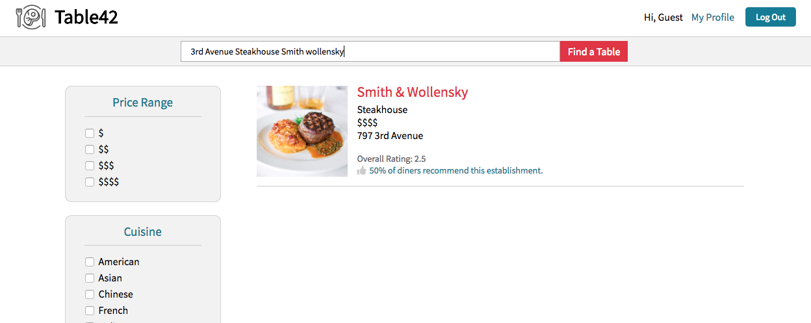
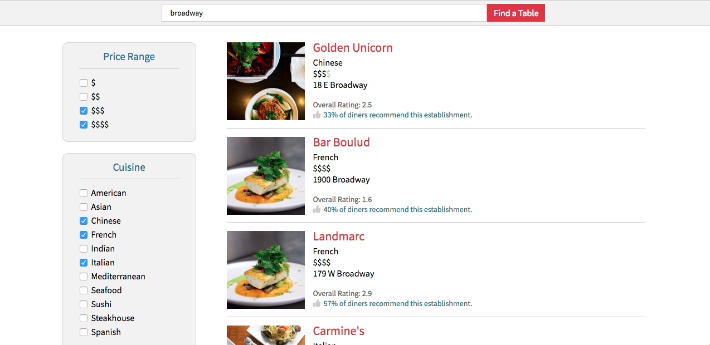
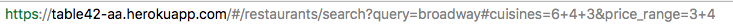
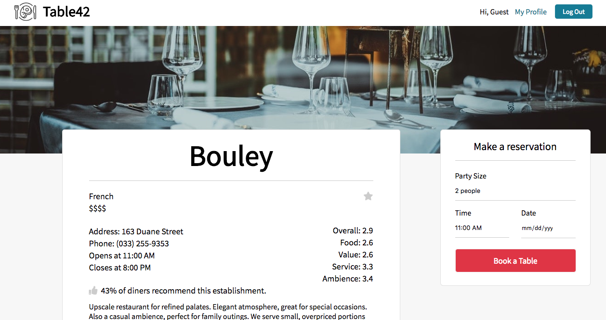
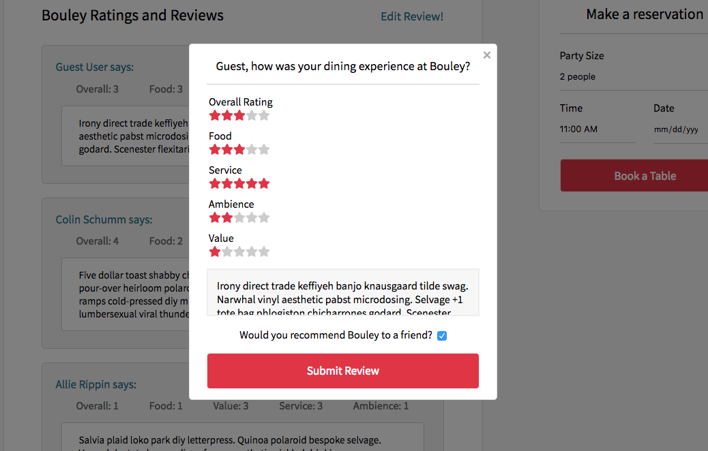
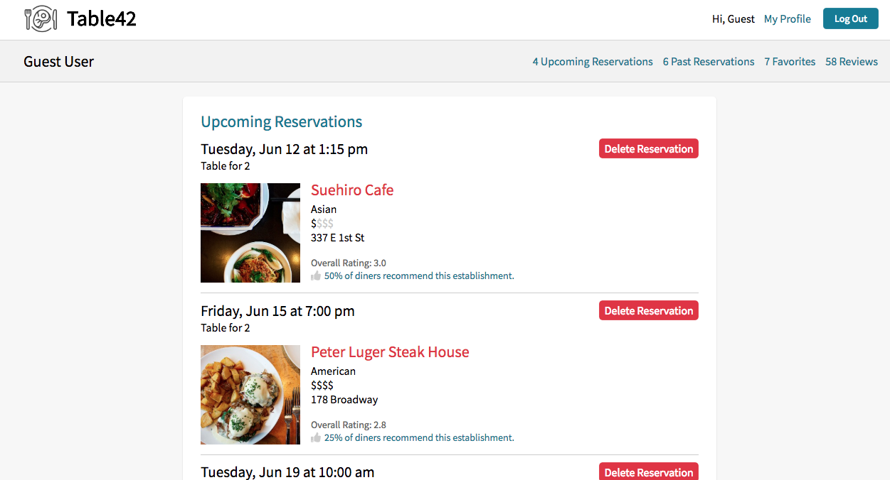

# Table42

Live Version: https://table42-aa.herokuapp.com/#/

Table42 (pronounced "table for two") is a web application inspired by OpenTable, featuring restaurant search, creation of reservations and reviews, and user management of upcoming reservations. It was built with a React/Redux frontend and Ruby on Rails/PostgreSQL backend.

# Features

### Restaurant Search

Table42 employs full-text search and restaurant geocoding data to return only the results relevant to the user's search query. When a restaurant is created and saved to the database, its latitude and longitude are computed and stored using the Geocoder gem and Google Geocoding API. On the backend, search results are compiled with a reference to a user's city (declared at the time of registration), returning only restaurants within a specified radius from the user's location, ordered by their respective distance. Full-text search, implemented using the PGSearch gem, allows for user queries such as "3rd Avenue steakhouse Smith Wollensky" which spans across multiple table columns and model associations.



If the search bar is void of text (i.e. an empty string as the query), the application's default behavior is to substitute the user's city as a query parameter. The search result page also includes front-end filtering to dynamically re-render which restaurants are displayed. URL hash fragments reflect the current filter selections, allowing shareable/savable links.





A higher-order React component was designed to allow multiple search filters to be easily implemented.

```javascript
class SearchFilter extends React.Component {
  constructor(props) {
    super(props);

    const { location, filterType, choicesArray } = this.props;

    const relevantSubstring = relevantHashSubstring(location.hash, filterType);
    const checkedInputs = parseSelections(relevantSubstring);

    this.state = merge({ checkedInputs }, optionCheckedStatus(choicesArray, checkedInputs));
    this.handleChange = this.handleChange.bind(this);
  }
  //  ...
}  
```

### Restaurant Details

Restaurant show pages include a restaurant overview (with aggregate ratings from reviews), forms to book reservations and leave reviews, a favorite button, and a Google Maps component to display the restaurant's location. Reservation requests are validated server-side to ensure the proposed party size at a specific date-time will not cause the restaurant to overbook.



The link to write a review opens a modal component; successfully submitted reviews are rendered in realtime. If a user has already reviewed a particular restaurant, the link to edit the review opens a pre-filled form as shown below:



### Profile Page

Users can manage their upcoming reservations, view past reservations, edit and delete reviews and quickly access their favorite restaurants from the user profile page.



### User Authentication

The application features end-to-end authentication, with a login modal popping up on any protected action on the frontend (e.g. attempting to book a reservation or visit /my/profile when logged out) and backend validations to ensure the current user is authorized to take specific actions (e.g. attempting to delete a reservation, or edit a review).

### UI/UX

Table42 ensures a strong user experience with all actions accompanied by visual confirmation of success or failure. Redux reducers were created to manage specific UI slices of state, such as review confirmation messages and search error messages.

# Future Directions

* Implementing fuzzy and trigram search to handle minor misspellings or phonetic spellings of restaurant names
* Refactoring the search bar to include date-time and party size parameters, yielding a more specific subset of results
* Reconfiguring the reservation form to present multiple available time options, rather than immediately attempt to book the requested time. 
